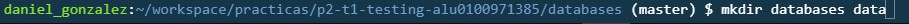
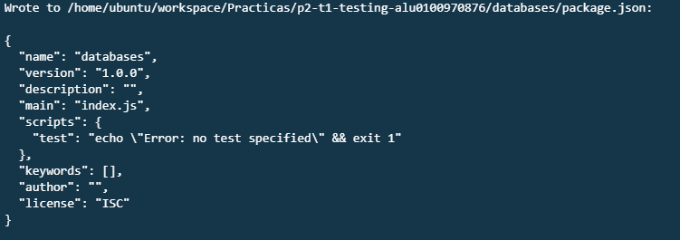
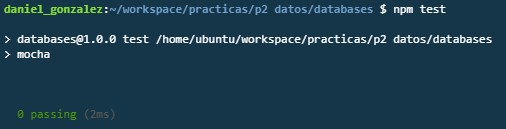

# p2-t1-testing-alu0100971385
p2-t1-testing-alu0100971385 created by GitHub Classroom

En esta práctica hemos aprendido a utilizar Node.js a transformar datos XML en JSON.
Teniendo en cuenta que ya debíamos tener instalado NodeJS, ahora procederemos a instalar las distintas dependencias
que usaremos para transformar datos XML en JSON, desarrollando también pruebas unitarias, realizando así una
metodología de desarrollodo dirigida por pruebas (TDD).

En primer lugar, debemos crear dos carpetas data y databases. El directorio data tendrá los datos sobre los libros
en formato rdf que está basado en XML. En el directorio databases tendremos todo lo relacionado con el código fuente
de esta práctica.

Primero descargamos los datos de los libros de la siguiente manera:

$cd data
$curl -O http://www.gutenberg.org/cache/epub/feeds/rdf-files.tar.bz2
$tar -xvjf rdf-files.tar.bz2	

Una vez descargados y extraídos, podemos proceder a empezar con los ficheros de código fuente.
En primer lugar, vamos a desplazarnos al directorio databases. Luego vamos a inicializar el package.json.

Ahora instalamos chai y mocha que son las dependencias que usaremos para los expect y los test, respectivamente.
Esto lo hacemos con:

$npm	install --save-dev --save-exact mocha@2.4.5	chai@3.5.0

En mi caso, tuve que instalar estas versiones aunque el profesor recomendó instalar las últimas, puesto que al hacer
el primer npm test, las últimas versiones me generaban un error.

Ahora debemos añadir las dependencias al package.json, esto se hace de la siguiente manera:

//aqui va una foto del package.json

Dentro de database se crea una nueva carpeta llamada test, que contendrá nuestro fichero de expectativas:

//foto de los directorios (usa tree)

Al hacer 'npm test' por primera vez, nos muestra que el test ha salido exitoso (puesto que hay 0 tests este
comportamiento es normal).

Ahora creamos un nuevo fichero parse-rdf-test.js que contendrá nuestra primera expectativa, en la que espera
que parseRDF será una "function". Lo hacemos de la siguiente manera:

//captura del parse-rdf-test y su primer test

Copiamos el fichero con codigo 132 desde los datos hasta el directorio test, pues trabajaremos con él. Ahora
ejecutamos 'npm test' y veremos que nos muestra un error puesto que la función parseRDF no está definida.

Ahora debemos crear un nuevo directorio lib dentro de databases, y dentro crearemos un fichero parse-rdf.js. En este
fichero declararemos todas las variables y objetos necesarios para realizar nuestros test. Una vez hecho esto,
volveremos al archivo de test para crear una nueva constante que será parseRDF, que cogerá la función anónima que
se ha asignado a module.exports en el fichero parse-rdf.js

Ahora al realizar 'npm test', este test saldrá aceptado:

//aqui va la 4.5

.
.
.
