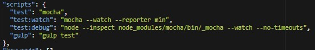

# RESUMEN DE PRÁCTICA 2 - TDD
Daniel Eduardo González Marrero - alu0100971385

En esta práctica hemos aprendido a utilizar Node.js a transformar datos XML en JSON.
Teniendo en cuenta que ya debíamos tener instalado NodeJS, ahora procederemos a instalar las distintas dependencias
que usaremos para transformar datos XML en JSON, desarrollando también pruebas unitarias, realizando así una
metodología de desarrollodo dirigida por pruebas (TDD).

En primer lugar, debemos crear dos carpetas data y databases. El directorio data tendrá los datos sobre los libros
en formato rdf que está basado en XML. En el directorio databases tendremos todo lo relacionado con el código fuente
de esta práctica.

Primero descargamos los datos de los libros de la siguiente manera:

$cd data

$curl -O http://www.gutenberg.org/cache/epub/feeds/rdf-files.tar.bz2

$tar -xvjf rdf-files.tar.bz2	

Una vez descargados y extraídos, podemos proceder a empezar con los ficheros de código fuente.
En primer lugar, vamos a desplazarnos al directorio databases. Luego vamos a inicializar el package.json.

Ahora instalamos chai y mocha que son las dependencias que usaremos para los expect y los test, respectivamente.
Esto lo hacemos con:

$npm	install --save-dev --save-exact mocha@2.4.5	chai@3.5.0

En mi caso, tuve que instalar estas versiones aunque el profesor recomendó instalar las últimas, puesto que al hacer
el primer npm test, las últimas versiones me generaban un error.

Ahora debemos añadir las dependencias al package.json, esto lo hacemos añadiendo "test": "mocha" debajo de scripts:

Dentro de database se crea una nueva carpeta llamada test, que contendrá nuestro fichero de expectativas:

Al hacer 'npm test' por primera vez, nos muestra que el test ha salido exitoso (puesto que hay 0 tests este
comportamiento es normal).

Ahora creamos un nuevo fichero parse-rdf-test.js que contendrá nuestra primera expectativa, en la que espera
que parseRDF será una "function". Lo hacemos de la siguiente manera:

Copiamos el fichero con codigo 132 desde los datos hasta el directorio test, pues trabajaremos con él. Ahora
ejecutamos 'npm test' y veremos que nos muestra un error puesto que la función parseRDF no está definida.

Ahora debemos crear un nuevo directorio lib dentro de databases, y dentro crearemos un fichero parse-rdf.js. En este
fichero declararemos todas las variables y objetos necesarios para realizar nuestros test. Una vez hecho esto,
volveremos al archivo de test para crear una nueva constante que será parseRDF, que cogerá la función anónima que
se ha asignado a module.exports en el fichero parse-rdf.js

Ahora al realizar 'npm test', este test saldrá aceptado:

A partir de ahora, mantenemos la metodología TDD. Es decir, vamos desarrollando pruebas que forzamos a que fallen,
y luego desarrollamos la cantidad de código mínimo indispensable para poder satisfacer la prueba, para luego
refactorizar. Para agilizar este proceso, podemos añadir al package.json bajo scripts las lineas
"test:watch": "mocha --watch --reporter min", con el objetivo de ejecutar automaticamente los test cada vez que
se modifique un fichero, al propio estilo Guard cuando desarrollábamos basándonos en TDD con Ruby en LPP.

Ejecutando con npm run test:watch ocurre lo siguiente:

De esta manera, cada vez que se modifica algún fichero se actualizan los test.

Ahora, utilizaremos la librería Cheerio (es un parser de XML) para conseguir extraer los datos de los XML de los libros y así poder
realizar pruebas con ellos. Para ello instalamos cheerio:

$npm install --save --save-exact cheerio@0.22.0

Ahora, añadimos un nuevo test que comprueba que el id del libro que hemos cogido sea 132. En este caso, fallará, debido
a que no hemos definido en ningún lado la variable id. Aquí entra en juego Cheerio. En el fichero parse-rdf.js debemos añadir
lo siguiente:

Realizaremos estos pasos con otros atributos del libro, que serán title, authors y subjects. En el parse-rdf.js tendremos
las definiciones de cada una de estas variables. Nos quedarían así los ficheros parse-rdf-test.js y parse-rdf.js:

Ahora crearemos un nuevo fichero dentro de databases que se llamará rdf-to-json, que cogerá un archivo rdf dentro de
la carpeta data, donde se encuentran los .rdf de todos los libros, y sólo mostrará los datos que queremos:
id, title, authors y subjects.

Elasticsearch tiene una api de bulk que permite trabajar con múltiples entradas simultáneamente. De esta manera, instalamos
una nueva librería llamada node-dir, de la siguiente manera:

$npm install --save --save-exact node-dir@0.1.16

Ahora podemos definir nuestro nuevo fichero rdf-to-bulk.js para poder transformar de rdf a ficheros compatibles con la API de bulk.
El fichero nos quedaría de esta manera:

y al ejecutar con:

$node rdf-to-bulk.js ../data/cache/epub/ | head

Vemos que se generan 10 líneas que han sido truncadas para que encajen en la página:

Ahora podemos guardar toda la salida bulk de todos los ficheros rdf en un nuevo fichero bulk_pg.ldj haciendo lo siguiente:

$node	rdf-to-bulk.js ../data/cache/epub/ > ../data/bulk_pg.ldj	

Tardará un rato, puesto que son muchísimas líneas, para más de 50.000 libros.

También configuré gulp para agilizar la ejecución de los test, asigándolo a la tarea default de gulp. De esta manera, simplemente
ejecutando 'gulp' ya se ejecutan los test:

Ahora, realizamos el primer ejercicio del libro, añadiendo el test, forzando a que falle:

Ahora completamos el código necesario para que el test sea aceptado, añadiendo el atributo LCC:

Por último, configuramos el repo para la integración continua con Travis.
